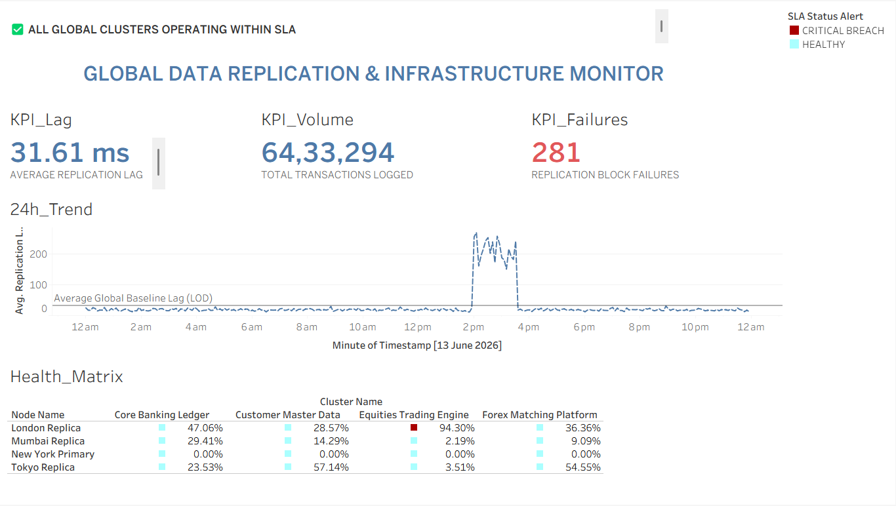

# Global Enterprise Ledger & Database Replication Monitor

## 🌐 Project Overview
This repository contains an enterprise-grade infrastructure operations command terminal designed to monitor real-time data synchronization health and transactional integrity across distributed global banking databases (New York, London, Mumbai, Tokyo). 

The project bridges low-level backend systems telemetry with operational risk intelligence by tracking millisecond-level data replication lag, isolating localized database bottlenecks, and mapping technical system failures to corporate SLA impacts.

---

## 📊 Terminal Preview

---

## 🛠️ Core Engineering Infrastructure & Features

### 1. Data Architecture & Python Generation Pipeline
* **Multi-Node Simulation:** Developed a custom Python pipeline using `Pandas` and `NumPy` to architect synthetic historical transaction logs across four international ledger nodes.
* **Anomaly Injection:** Mathematically modeled and injected localized technical infrastructure failures—including an acute transatlantic network degradation between 2:00 PM and 4:00 PM—to test downstream visual exception-handling pipelines.

### 2. Advanced Analytics Layer (Tableau Logic)
* **Immutable Performance Baselines:** Engineered and deployed a Level of Detail (LOD) expression to lock the global performance threshold across 640K+ transactions regardless of localized filters applied to individual sheets:
  $$\{FIXED [Timestamp] : AVG([Replication Lag Ms])\}$$
* **Risk Quantification Matrix:** Authored multi-layer conditional calculations and window functions to isolate the "blast radius" of network bottlenecks, pinpointing the exact nodes driving systemic replication blocks.

### 3. Dynamic Incident Control Framework
* **Situational Awareness UI:** Replicated a mission-critical command center display with sharp, minimalist layout hierarchies to eliminate user cognitive fatigue during critical system failures.
* **Recalibration Parameters:** Configured User-Defined Parameters linked directly to a context-aware Dynamic Status Banner, allowing active site reliability engineers to adjust corporate SLA risk thresholds on the fly.

---

## 📂 Repository Contents
* `Global_Ledger_Monitor.twbx`: Packaged Tableau Desktop workbook containing all primary calculations, custom matrices, parameters, and layout dashboards.
* `dashboard_preview.png`: High-density interface layout rendering.

## 🚀 Technical Competencies Showcased
* Data Warehouse Star Schema Modeling
* Advanced Tableau Desktop Analytics & LOD Logic
* Systems Telemetry Log Structuring & Python Simulations
* Corporate Operational Risk & SLA Mapping
